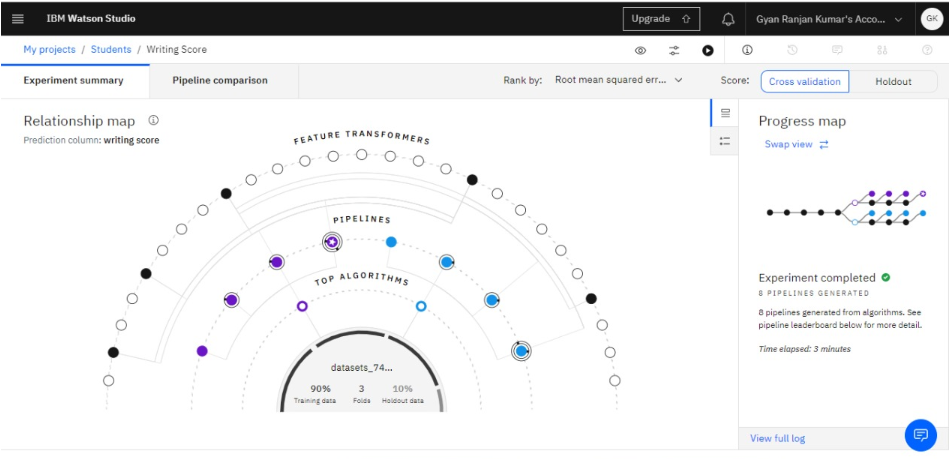
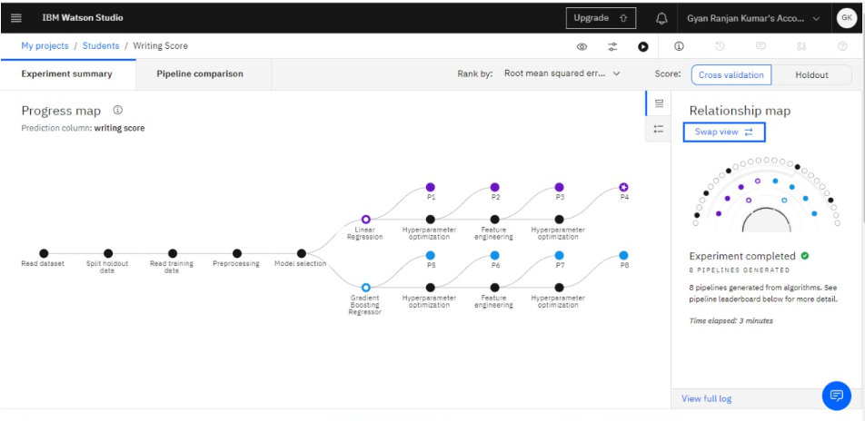
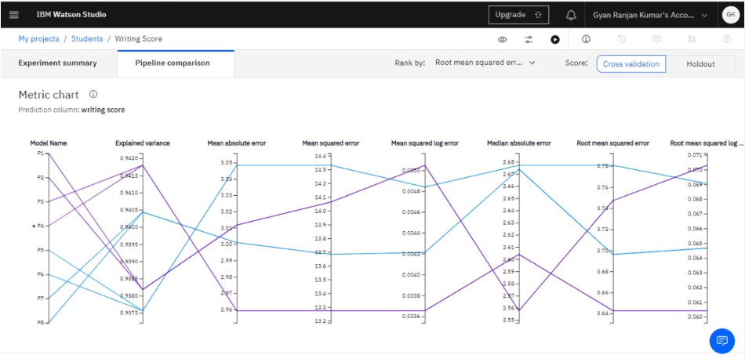
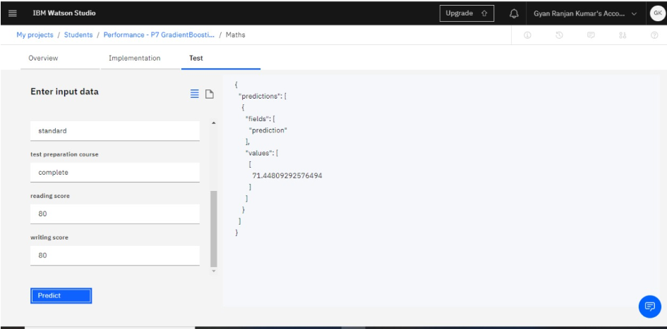
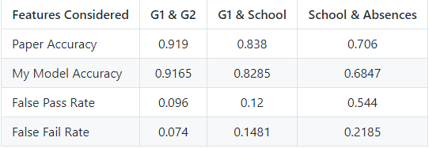

# llSPS-INT-3438-Students-Performance-in-exam-Grade-Analysis-using-Watson-Auto-AI

* ## Introduction:
  Students Performance Evaluation using Feature Engineering, Feature Extraction, Manipulation of Data, Data Analysis, Data
  Visualization and at lat applying Classification Algorithms from Machine Learning to Separate Students with different grades
  
  
* ## Table of Content
    * AIM
    * Project Description 
    * Process Flow - Flowchart
    * Skill Used
    * Demo
    * Conclusion
    * User

* ## AIM:
    Students Performance in exam (Grade Analysis) using Watson Auto AI
    
    
* ## Process Flow - Flowchart:
    
    
     ### Data Set Pipeline:
    
    
    
    ### Data Set Flow:
    
    
      
    
* ## Project Description:
  With the wide usage of computers and internet, there has recently been a huge increase in publicly available data that can be
  analysed. Be it online sales information, website traffic, or user habits, data is generated every day. Such a large amount of data
  presents both a problem and an opportunity. The problem is that it is difficult for humans to analyse such large data. The 
  opportunity is that this type of data is ideal for computers to process, because it is stored digitally in a well-formatted way, and 
  computers can process data much faster than humans. In schools and higher educational institutes, many students have to struggle hard 
  to pass exams since there is no dedicated support offered to students who need special attention in the relevant courses.
  This thesis examines the application of machine learning algorithms to predict whether a student will be successful or not. Machine
  learning techniques can be utilized for students’ grades prediction in different courses. Such techniques would help students to 
  improve their performance based on predicted grades and would enable instructors to identify such individuals who might need 
  assistance in the courses. This is best suited for online courses.
    ### Solution:
     We are building a Machine Learning model to predict the material using IBM Watson AutoAI Machine Learning Service. The model is
     deployed on IBM cloud to get scoring end point which can be used as API in mobile app or web app building. We are developing a web
     application which is built using node red service. We make use of the scoring end point to give user input values to the deployed
     model. The model prediction is then showcased on User Interface. This model is to predict the performance of students in exam in 
     grade distribution based by using different input parameters.
     
    
* ## Skills Required:
      Python, Python For Data Analysis, Machine Learning, IBM Cloud, IBM Watson.
      
     
      
      
* ## Demo:
     
     
     
* ## Demo Video:     
     [Demo Video](https://drive.google.com/file/d/1RHq0QqusSZp3UJ4HkBV2bzzGYZLM8OQR/view?usp=sharing)
    
    
* ## Conclusion
  The following results have been averaged over 5 trials.
  
  

  
    
* ## User:
    [Gyan Ranjan](https://github.com/GyanC7)

      
 

